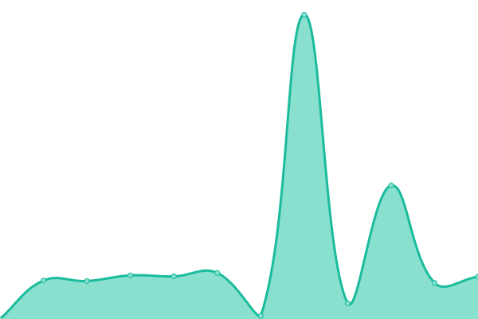

# [📈 Live Status](https://status.fussel.tv): <!--live status--> **🟧 Partial outage**

This repository contains the open-source uptime monitor and status page for [Christian](https://status.fussel.tv), powered by [Upptime](https://github.com/upptime/upptime).

With [Upptime](https://upptime.js.org), you can get your own unlimited and free uptime monitor and status page, powered entirely by a GitHub repository. We use [Issues](https://github.com/FusselTV/status/issues) as incident reports, [Actions](https://github.com/FusselTV/status/actions) as uptime monitors, and [Pages](https://status.fussel.tv) for the status page.

<!--start: status pages-->
<!-- This summary is generated by Upptime (https://github.com/upptime/upptime) -->
<!-- Do not edit this manually, your changes will be overwritten -->
<!-- prettier-ignore -->
| URL | Status | History | Response Time | Uptime |
| --- | ------ | ------- | ------------- | ------ |
|  [FRITZ!Box](https://avm.fussel.tv) | 🟩 Up | [fritz-box.yml](https://github.com/FusselTV/status/commits/HEAD/history/fritz-box.yml) | 

 726ms
     
 | 

<a href="https://status.fussel.tv/history/fritz-box">100.00%</a>
    

|  [Bitwarden](https://vault.fussel.tv) | 🟩 Up | [bitwarden.yml](https://github.com/FusselTV/status/commits/HEAD/history/bitwarden.yml) | 

 2040ms
     
 | 

<a href="https://status.fussel.tv/history/bitwarden">99.74%</a>
    

|  [Home Assistant](https://ha.fussel.tv) | 🟩 Up | [home-assistant.yml](https://github.com/FusselTV/status/commits/HEAD/history/home-assistant.yml) | 

 1299ms
     
 | 

<a href="https://status.fussel.tv/history/home-assistant">99.75%</a>
    

|  [Portainer](https://portainer.fussel.tv/) | 🟩 Up | [portainer.yml](https://github.com/FusselTV/status/commits/HEAD/history/portainer.yml) | 

 299ms
     
 | 

<a href="https://status.fussel.tv/history/portainer">100.00%</a>
    

|  [Nginx](https://nginx.fussel.tv/) | 🟩 Up | [nginx.yml](https://github.com/FusselTV/status/commits/HEAD/history/nginx.yml) | 

 306ms
     
 | 

<a href="https://status.fussel.tv/history/nginx">100.00%</a>
    

|  [Kutt](https://0987.win/) | 🟥 Down | [kutt.yml](https://github.com/FusselTV/status/commits/HEAD/history/kutt.yml) | 

 799ms
     
 | 

<a href="https://status.fussel.tv/history/kutt">97.51%</a>
    

<!--end: status pages-->

[**Visit our status website →**](https://status.fussel.tv)

## 📄 License

- Powered by: [Upptime](https://github.com/upptime/upptime)
- Code: [MIT](./LICENSE) © [Christian](https://status.fussel.tv)
- Data in the `./history` directory: [Open Database License](https://opendatacommons.org/licenses/odbl/1-0/)
