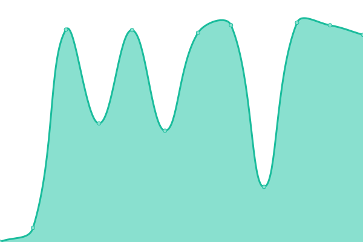

# [📈 Live Status](https://status.fussel.tv): <!--live status--> **🟧 Partial outage**

This repository contains the open-source uptime monitor and status page for [Christian](https://status.fussel.tv), powered by [Upptime](https://github.com/upptime/upptime).

With [Upptime](https://upptime.js.org), you can get your own unlimited and free uptime monitor and status page, powered entirely by a GitHub repository. We use [Issues](https://github.com/FusselTV/status/issues) as incident reports, [Actions](https://github.com/FusselTV/status/actions) as uptime monitors, and [Pages](https://status.fussel.tv) for the status page.

<!--start: status pages-->
<!-- This summary is generated by Upptime (https://github.com/upptime/upptime) -->
<!-- Do not edit this manually, your changes will be overwritten -->
<!-- prettier-ignore -->
| URL | Status | History | Response Time | Uptime |
| --- | ------ | ------- | ------------- | ------ |
|  [Router](https://avm.fussel.tv) | 🟥 Down | [router.yml](https://github.com/FusselTV/status/commits/HEAD/history/router.yml) | 

 1451ms
     
 | 

<a href="https://status.fussel.tv/history/router">99.56%</a>
    

|  [Bitwarden](https://vault.fussel.tv) | 🟩 Up | [bitwarden.yml](https://github.com/FusselTV/status/commits/HEAD/history/bitwarden.yml) | 

 579ms
     
 | 

<a href="https://status.fussel.tv/history/bitwarden">100.00%</a>
    

|  [Home Assistant](https://ha.fussel.tv) | 🟩 Up | [home-assistant.yml](https://github.com/FusselTV/status/commits/HEAD/history/home-assistant.yml) | 

 573ms
     
 | 

<a href="https://status.fussel.tv/history/home-assistant">100.00%</a>
    

|  [Mails](https://ams.daportal.net/roundcube/) | 🟩 Up | [mails.yml](https://github.com/FusselTV/status/commits/HEAD/history/mails.yml) | 

 550ms
     
 | 

<a href="https://status.fussel.tv/history/mails">100.00%</a>
    

<!--end: status pages-->

[**Visit our status website →**](https://status.fussel.tv)

## 📄 License

- Powered by: [Upptime](https://github.com/upptime/upptime)
- Code: [MIT](./LICENSE) © [Christian](https://status.fussel.tv)
- Data in the `./history` directory: [Open Database License](https://opendatacommons.org/licenses/odbl/1-0/)
